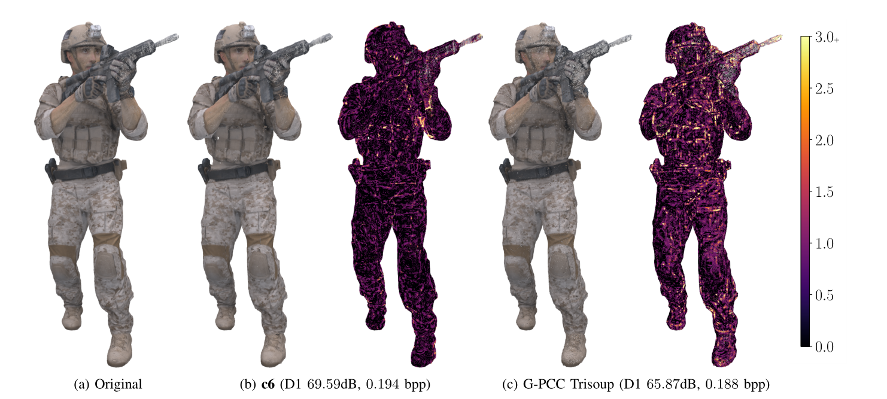

# DeepCompress: Efficient Point Cloud Geometry Compression



## Authors

- [Ryan Killea](https://rbkillea.com/)
- [Saeed Bastani](https://scholar.google.com/citations?user=m0tkD4YAAAAJ&hl=en)
- Yun Li
- [Paul McLachlan](http://pmclachlan.com)

**Affiliation**: Ericsson Research  
**Paper**: [Research Paper (arXiv)](https://arxiv.org/abs/2106.01504)

## Abstract

Point clouds are a basic data type of growing interest due to their use in applications such as virtual, augmented, and mixed reality, and autonomous driving. This work presents DeepCompress, a deep learning-based encoder for point cloud compression that achieves efficiency gains without significantly impacting compression quality. Through optimization of convolutional blocks and activation functions, our architecture reduces the computational cost by 8% and model parameters by 20%, with only minimal increases in bit rate and distortion.

## Reproducing Paper Results

### 1. Environment Setup
```bash
# Clone repository
git clone https://github.com/pmclsf/deepcompress.git
cd deepcompress

# Create and activate virtual environment
python -m venv env
source env/bin/activate

# Install dependencies
pip install -r requirements.txt

# Create necessary directories
mkdir -p data/modelnet40
mkdir -p data/8ivfb
mkdir -p results/models
mkdir -p results/metrics
```

### 2. Dataset Preparation
```bash
# Download and prepare ModelNet40
wget http://modelnet.cs.princeton.edu/ModelNet40.zip
unzip ModelNet40.zip -d data/modelnet40/

# Download 8iVFB dataset
# Note: Requires registration at http://plenodb.jpeg.org
mv 8iVFB_v2.zip data/8ivfb/
unzip data/8ivfb/8iVFB_v2.zip -d data/8ivfb/

# Process ModelNet40 for training
python ds_select_largest.py \
    data/modelnet40/ModelNet40 \
    data/modelnet40/ModelNet40_200 \
    200

python ds_mesh_to_pc.py \
    data/modelnet40/ModelNet40_200 \
    data/modelnet40/ModelNet40_200_pc512 \
    --vg_size 512

python ds_pc_octree_blocks.py \
    data/modelnet40/ModelNet40_200_pc512 \
    data/modelnet40/ModelNet40_200_pc512_oct3 \
    --vg_size 512 \
    --level 3

python ds_select_largest.py \
    data/modelnet40/ModelNet40_200_pc512_oct3 \
    data/modelnet40/ModelNet40_200_pc512_oct3_4k \
    4000
```

### 3. Training Pipeline
```bash
# Create training configuration
cat > config/train_config.yml << EOL
data:
  modelnet40_path: "data/modelnet40/ModelNet40_200_pc512_oct3_4k"
  ivfb_path: "data/8ivfb"
  resolution: 64
  block_size: 1.0
  min_points: 100
  augment: true

model:
  filters: 64
  activation: "cenic_gdn"
  conv_type: "separable"

training:
  batch_size: 32
  epochs: 100
  learning_rates:
    reconstruction: 1.0e-4
    entropy: 1.0e-3
  focal_loss:
    alpha: 0.75
    gamma: 2.0
  checkpoint_dir: "results/models"
EOL

# Train model
python training_pipeline.py config/train_config.yml
```

### 4. Evaluation Pipeline
```bash
# Run evaluation on 8iVFB dataset
python evaluation_pipeline.py \
    config/train_config.yml \
    --checkpoint results/models/best_model

# Generate comparison metrics
python ev_compare.py \
    --original data/8ivfb \
    --compressed results/compressed \
    --output results/metrics

# Generate visualizations
python ev_run_render.py config/train_config.yml
```

### 5. Compare with G-PCC
```bash
# Run G-PCC experiments
python mp_run.py config/train_config.yml --num_parallel 8

# Generate final report
python mp_report.py \
    results/metrics/evaluation_report.json \
    results/metrics/final_report.json
```

### Expected Results

After running the complete pipeline, you should observe:
- 8% reduction in total operations
- 20% reduction in model parameters
- D1 metric: 0.02% penalty
- D2 metric: 0.32% increased bit rate

The results can be found in:
- Model checkpoints: `results/models/`
- Evaluation metrics: `results/metrics/final_report.json`
- Visualizations: `results/visualizations/`

## Prerequisites

### Required Software

- Python 3.8+
- MPEG G-PCC codec [mpeg-pcc-tmc13](https://github.com/MPEGGroup/mpeg-pcc-tmc13)
- MPEG metric software v0.12.3 [mpeg-pcc-dmetric](http://mpegx.int-evry.fr/software/MPEG/PCC/mpeg-pcc-dmetric)
- MPEG PCC dataset

### Dependencies

Required packages:
- tensorflow >= 2.11.0
- tensorflow-probability >= 0.19.0
- matplotlib ~= 3.1.3
- numpy ~= 1.23.0
- pandas ~= 1.4.0
- pyyaml ~= 5.1.2
- scipy ~= 1.8.1
- numba ~= 0.55.0

## Model Architecture

### Network Overview
- Analysis-synthesis architecture with scale hyperprior
- Incorporates GDN/CENIC-GDN activation functions
- Novel 1+2D spatially separable convolutional blocks
- Progressive channel expansion with dimension reduction

### Key Components
- **Analysis Network**: Processes input point clouds through multiple analysis blocks
- **Synthesis Network**: Reconstructs point clouds from compressed representations
- **Hyperprior**: Learns and encodes additional parameters for entropy modeling
- **Custom Activation**: Uses CENIC-GDN for improved efficiency

### Spatially Separable Design
The architecture employs 1+2D convolutions instead of full 3D convolutions, providing:
- More parameter efficiency for same input/output channels
- Reduced operation count
- Better filter utilization
- Encoded knowledge of point cloud surface properties

## Implementation Details

### Point Cloud Metrics

```python
from pc_metric import calculate_metrics

metrics = calculate_metrics(predicted_points, ground_truth_points)
print(f"D1: {metrics['d1']}")
print(f"D2: {metrics['d2']}")
print(f"Chamfer: {metrics['chamfer']}")
```

Supported metrics include:
- **D1**: Point-to-point distances from predicted to ground truth
- **D2**: Point-to-point distances from ground truth to predicted
- **Chamfer Distance**: Combined D1 + D2 metric
- **Normal-based metrics** (when normals are available):
  - N1: Point-to-normal distances from predicted to ground truth
  - N2: Point-to-normal distances from ground truth to predicted

### Data Processing Pipeline

```python
# Analysis Transform for encoding
transform = AnalysisTransform(
    filters=64,
    kernel_size=(3, 3, 3),
    strides=(2, 2, 2)
)

# Synthesis Transform for decoding
synthesis = SynthesisTransform(
    filters=32,
    kernel_size=(3, 3, 3),
    strides=(2, 2, 2)
)
```

Key components:
- Residual connections
- Custom activation functions
- Normalization layers
- Efficient 3D convolutions

## Project Structure

### Source Code (`/src`)

- **Core Processing**
  - `compress_octree.py`: Point cloud octree compression
  - `decompress_octree.py`: Point cloud decompression
  - `ds_mesh_to_pc.py`: Mesh to point cloud conversion
  - `ds_pc_octree_blocks.py`: Octree block partitioning

- **Model Components**
  - `entropy_model.py`: Entropy modeling and compression
  - `model_transforms.py`: Model transformations
  - `point_cloud_metrics.py`: Point cloud metrics computation

- **Training & Evaluation**
  - `cli_train.py`: Command-line training interface
  - `training_pipeline.py`: Training pipeline
  - `evaluation_pipeline.py`: Evaluation pipeline
  - `experiment.py`: Core experiment utilities

- **Support Utilities**
  - `colorbar.py`: Visualization colorbars
  - `map_color.py`: Color mapping
  - `octree_coding.py`: Octree encoding
  - `parallel_process.py`: Parallel processing

### Test Structure (`/tests`)

- **Core Tests**
  - `test_entropy_model.py`: Entropy model tests
  - `test_model_transforms.py`: Model transformation tests
  - `test_point_cloud_metrics.py`: Metrics computation tests

- **Pipeline Tests**
  - `test_training_pipeline.py`: Training pipeline tests
  - `test_evaluation_pipeline.py`: Evaluation pipeline tests
  - `test_experiment.py`: Experiment utility tests
  - `test_integration.py`: End-to-end integration tests

- **Data Processing Tests**
  - `test_ds_mesh_to_pc.py`: Mesh conversion tests
  - `test_ds_pc_octree_blocks.py`: Octree block tests

- **Utility Tests**
  - `test_colorbar.py`: Visualization tests
  - `test_map_color.py`: Color mapping tests
  - `test_utils.py`: Common test utilities